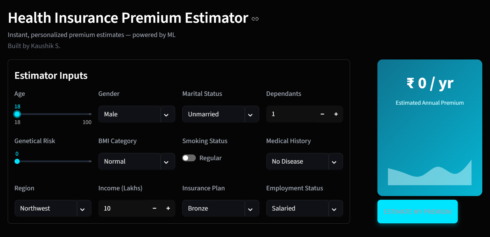
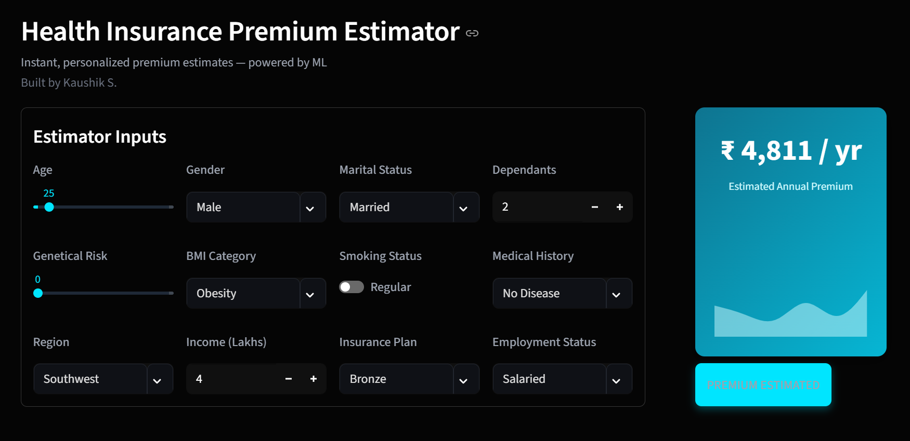

# Health Insurance Cost Estimator (ML-Powered)

A sleek, machine-learning–based web application that predicts annual health insurance premiums using user health, lifestyle, and demographic inputs.

The UI is built using Streamlit with a modern dark theme and a clean insurance dashboard-style layout.

---

## 🚀 Demo

### 🖥️ Before Estimation


### 🎨 After Estimation


---

## ✨ Features

- Modern **dark UI** inspired by finance & insurance dashboards  
- **Instant ML-powered premium estimation**  
- Smart dynamic input controls (sliders, toggles, dropdowns, numeric fields)  
- Beautiful **gradient premium card** with wave animation  
- Fully **responsive** — works smoothly on mobile  
- Automatically selects the right ML model based on age  
- Built-in preprocessing (scaling, encoding, risk normalization)

---

## 🧠 Machine Learning Overview

This project uses **two trained models** depending on the user's age:

| Age Group        | Model Used            |
|------------------|------------------------|
| ≤ 25 years        | `model_young.joblib`   |
| > 25 years        | `model_rest.joblib`    |

Additional ML components:

- `scaler_young.joblib`  
- `scaler_rest.joblib`  
- Custom **medical history risk scoring**  
- One-hot encoding for categorical features  
- Scaling + preprocessing pipeline inside `prediction_helper.py`

---

## 📁 Folder Structure

```
health-insurance-estimator/
│
├── main.py
├── prediction_helper.py
├── requirements.txt
├── README.md
│
├── artifacts/
│   ├── model_young.joblib
│   ├── model_rest.joblib
│   ├── scaler_young.joblib
│   ├── scaler_rest.joblib
│
└── assets/
    ├── ui_before.png
    ├── ui_after.png
```

---

## 🔧 Installation & Running Locally

### 1️⃣ Clone the repository
```bash
git clone https://github.com/<your-username>/<repo-name>.git
cd <repo-name>
```

### 2️⃣ Install dependencies
```bash
pip install -r requirements.txt
```

### 3️⃣ Run the Streamlit app
```bash
streamlit run main.py
```

---

## 🧩 Tech Stack

- Python  
- Streamlit  
- Pandas  
- XGBoost / Linear Regression  
- Joblib  
- Custom Feature Engineering + Scaling

---

## 📜 License

This project is for educational and demonstration purposes.

---

## ⭐ Support

If you found this project useful, consider **starring the repository** ⭐
